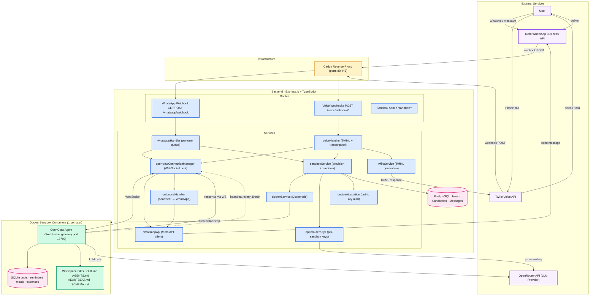
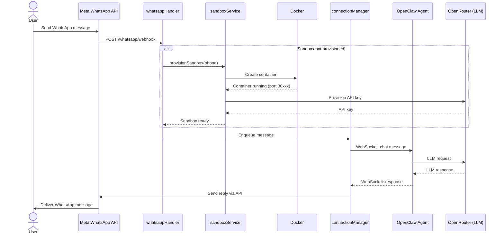
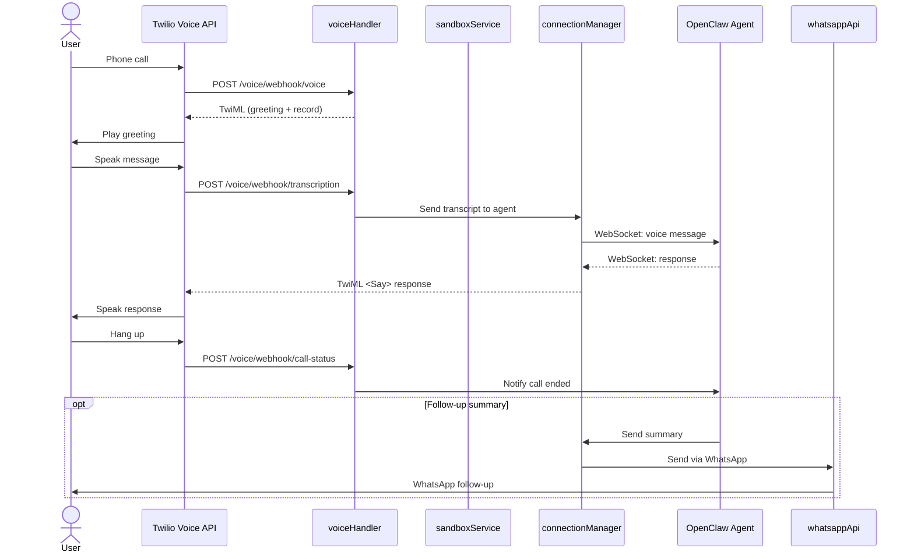
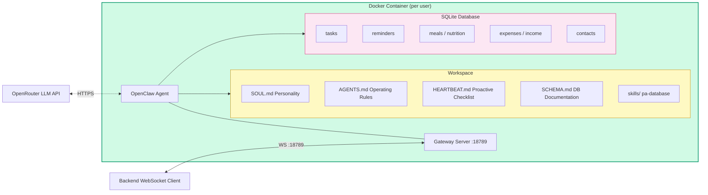
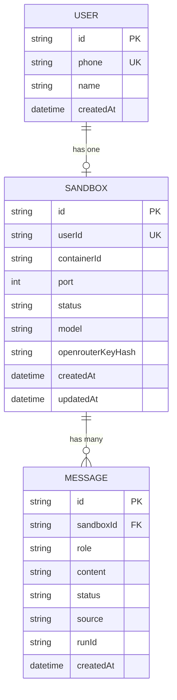
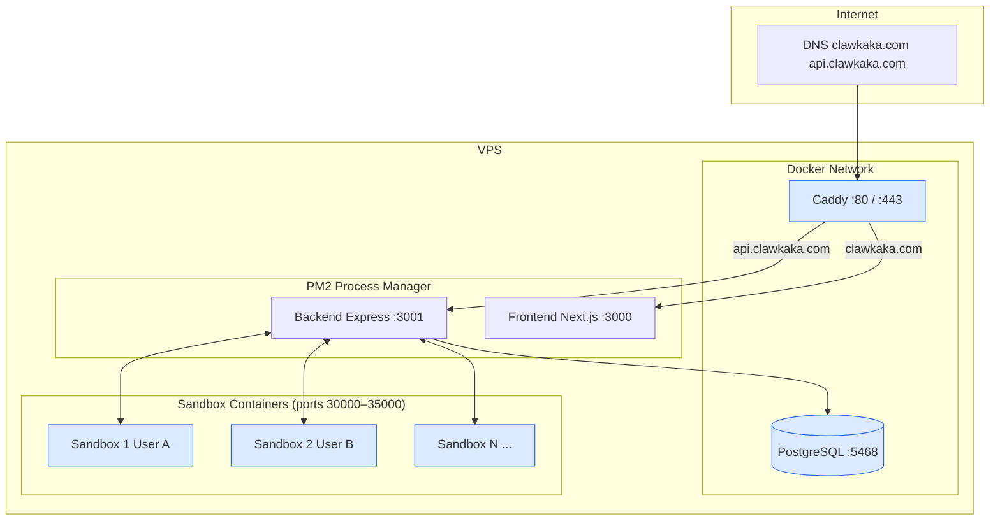

# Clawkaka Architecture

## System Overview

```mermaid
graph TB
    subgraph External["External Services"]
        User["User"]
        MetaAPI["Meta WhatsApp Business API"]
        TwilioAPI["Twilio Voice API"]
        OpenRouterAPI["OpenRouter API (LLM Provider)"]
    end

    subgraph Infra["Infrastructure"]
        Caddy["Caddy Reverse Proxy (ports 80/443)"]
    end

    subgraph Backend["Backend · Express.js + TypeScript"]
        direction TB

        subgraph Routes["Routes"]
            WAWebhook["WhatsApp Webhook GET/POST /whatsapp/webhook"]
            VoiceWebhook["Voice Webhooks POST /voice/webhook/*"]
            SandboxRoute["Sandbox Admin /sandbox/*"]
        end

        subgraph Services["Services"]
            WAHandler["whatsappHandler (per-user queue)"]
            VoiceHandler["voiceHandler (TwiML + transcription)"]
            OutboundHandler["outboundHandler (heartbeat → WhatsApp)"]
            WAApiClient["whatsappApi (Meta API client)"]
            TwilioSvc["twilioService (TwiML generation)"]
            ConnMgr["openclawConnectionManager (WebSocket pool)"]
            SandboxSvc["sandboxService (provision / teardown)"]
            DockerSvc["dockerService (Dockerode)"]
            ORKeys["openrouterKeys (per-sandbox keys)"]
            DeviceAttest["deviceAttestation (public key auth)"]
        end

        Postgres[("PostgreSQL Users · Sandboxes · Messages")]
    end

    subgraph Sandboxes["Docker Sandbox Containers (1 per user)"]
        direction TB
        OpenClaw["OpenClaw Agent (WebSocket gateway port 18789)"]
        SQLite[("SQLite tasks · reminders meals · expenses")]
        Workspace["Workspace Files SOUL.md · AGENTS.md HEARTBEAT.md · SCHEMA.md"]
    end

    %% ── User channels ──
    User -->|"WhatsApp message"| MetaAPI
    User -->|"Phone call"| TwilioAPI

    %% ── Inbound to backend ──
    MetaAPI -->|"webhook POST"| Caddy
    TwilioAPI -->|"webhook POST"| Caddy
    Caddy --> WAWebhook
    Caddy --> VoiceWebhook

    %% ── Route → Service ──
    WAWebhook --> WAHandler
    VoiceWebhook --> VoiceHandler

    %% ── Handler flows ──
    WAHandler --> ConnMgr
    WAHandler --> SandboxSvc
    VoiceHandler --> ConnMgr
    VoiceHandler --> SandboxSvc
    VoiceHandler --> TwilioSvc

    %% ── Sandbox provisioning ──
    SandboxSvc --> DockerSvc
    SandboxSvc --> ORKeys
    SandboxSvc --> DeviceAttest
    SandboxSvc --> Postgres
    ORKeys -->|"provision key"| OpenRouterAPI
    DockerSvc -->|"create/start/stop"| Sandboxes

    %% ── WebSocket to sandbox ──
    ConnMgr <-->|"WebSocket"| OpenClaw

    %% ── Outbound response ──
    OpenClaw -->|"response via WS"| ConnMgr
    ConnMgr --> WAApiClient
    ConnMgr --> OutboundHandler
    OutboundHandler --> WAApiClient
    WAApiClient -->|"send message"| MetaAPI
    MetaAPI -->|"deliver"| User

    TwilioSvc -->|"TwiML response"| TwilioAPI
    TwilioAPI -->|"speak / call"| User

    %% ── Sandbox internals ──
    OpenClaw --> SQLite
    OpenClaw --> Workspace
    OpenClaw -->|"LLM calls"| OpenRouterAPI

    %% ── Heartbeat (proactive) ──
    OpenClaw -.->|"heartbeat every 30 min"| ConnMgr

    %% ── Styling ──
    classDef external fill:#f9f0ff,stroke:#7c3aed,stroke-width:2px,color:#1e1e1e
    classDef infra fill:#fef3c7,stroke:#d97706,stroke-width:2px,color:#1e1e1e
    classDef backend fill:#dbeafe,stroke:#2563eb,stroke-width:2px,color:#1e1e1e
    classDef db fill:#fce7f3,stroke:#db2777,stroke-width:2px,color:#1e1e1e
    classDef sandbox fill:#d1fae5,stroke:#059669,stroke-width:2px,color:#1e1e1e

    class User,MetaAPI,TwilioAPI,OpenRouterAPI external
    class Caddy infra
    class WAWebhook,VoiceWebhook,SandboxRoute,WAHandler,VoiceHandler,OutboundHandler,WAApiClient,TwilioSvc,ConnMgr,SandboxSvc,DockerSvc,ORKeys,DeviceAttest backend
    class Postgres,SQLite db
    class OpenClaw,Workspace sandbox
```

## WhatsApp Message Flow

```mermaid
sequenceDiagram
    actor User
    participant Meta as Meta WhatsApp API
    participant WH as whatsappHandler
    participant SS as sandboxService
    participant Docker as Docker
    participant CM as connectionManager
    participant OC as OpenClaw Agent
    participant OR as OpenRouter (LLM)

    User->>Meta: Send WhatsApp message
    Meta->>WH: POST /whatsapp/webhook

    alt Sandbox not provisioned
        WH->>SS: provisionSandbox(phone)
        SS->>Docker: Create container
        Docker-->>SS: Container running (port 30xxx)
        SS->>OR: Provision API key
        OR-->>SS: API key
        SS-->>WH: Sandbox ready
    end

    WH->>CM: Enqueue message
    CM->>OC: WebSocket: chat message
    OC->>OR: LLM request
    OR-->>OC: LLM response
    OC-->>CM: WebSocket: response
    CM->>Meta: Send reply via API
    Meta->>User: Deliver WhatsApp message
```

## Voice Call Flow

```mermaid
sequenceDiagram
    actor User
    participant Twilio as Twilio Voice API
    participant VH as voiceHandler
    participant SS as sandboxService
    participant CM as connectionManager
    participant OC as OpenClaw Agent
    participant WA as whatsappApi

    User->>Twilio: Phone call
    Twilio->>VH: POST /voice/webhook/voice
    VH-->>Twilio: TwiML (greeting + record)

    Twilio->>User: Play greeting
    User->>Twilio: Speak message
    Twilio->>VH: POST /voice/webhook/transcription
    VH->>CM: Send transcript to agent
    CM->>OC: WebSocket: voice message
    OC-->>CM: WebSocket: response
    CM-->>Twilio: TwiML <Say> response
    Twilio->>User: Speak response

    User->>Twilio: Hang up
    Twilio->>VH: POST /voice/webhook/call-status
    VH->>OC: Notify call ended

    opt Follow-up summary
        OC->>CM: Send summary
        CM->>WA: Send via WhatsApp
        WA->>User: WhatsApp follow-up
    end
```

## Sandbox Container Architecture

```mermaid
graph LR
    subgraph Container["Docker Container (per user)"]
        direction TB
        OC["OpenClaw Agent"]
        GW["Gateway Server :18789"]

        subgraph Files["Workspace"]
            SOUL["SOUL.md Personality"]
            AGENTS["AGENTS.md Operating Rules"]
            HEARTBEAT["HEARTBEAT.md Proactive Checklist"]
            SCHEMA["SCHEMA.md DB Documentation"]
            SKILL["skills/ pa-database"]
        end

        subgraph DB["SQLite Database"]
            Tasks["tasks"]
            Reminders["reminders"]
            Meals["meals / nutrition"]
            Expenses["expenses / income"]
            Contacts["contacts"]
        end

        OC --- GW
        OC --> Files
        OC --> DB
    end

    Backend["Backend WebSocket Client"] <-->|"WS :18789"| GW
    LLM["OpenRouter LLM API"] <-.->|"HTTPS"| OC

    style Container fill:#d1fae5,stroke:#059669,stroke-width:2px
    style Files fill:#fef9c3,stroke:#ca8a04,stroke-width:1px
    style DB fill:#fce7f3,stroke:#db2777,stroke-width:1px
```

## Database Schema

```mermaid
erDiagram
    USER ||--o| SANDBOX : "has one"
    SANDBOX ||--o{ MESSAGE : "has many"

    USER {
        string id PK
        string phone UK
        string name
        datetime createdAt
    }

    SANDBOX {
        string id PK
        string userId UK
        string containerId
        int port
        string status
        string model
        string openrouterKeyHash
        datetime createdAt
        datetime updatedAt
    }

    MESSAGE {
        string id PK
        string sandboxId FK
        string role
        string content
        string status
        string source
        string runId
        datetime createdAt
    }
```

## Deployment Topology

```mermaid
graph TB
    subgraph Internet
        DNS["DNS clawkaka.com api.clawkaka.com"]
    end

    subgraph Server["VPS"]
        subgraph DockerNet["Docker Network"]
            PG[("PostgreSQL :5468")]
            CaddyDeploy["Caddy :80 / :443"]
        end

        subgraph PM2["PM2 Process Manager"]
            BE["Backend Express :3001"]
            FE["Frontend Next.js :3000"]
        end

        subgraph SandboxPool["Sandbox Containers (ports 30000–35000)"]
            S1["Sandbox 1 User A"]
            S2["Sandbox 2 User B"]
            S3["Sandbox N ..."]
        end
    end

    DNS --> CaddyDeploy
    CaddyDeploy -->|"clawkaka.com"| FE
    CaddyDeploy -->|"api.clawkaka.com"| BE
    BE --> PG
    BE <--> S1
    BE <--> S2
    BE <--> S3

    classDef docker fill:#dbeafe,stroke:#2563eb,stroke-width:1px
    class PG,CaddyDeploy,S1,S2,S3 docker
```
